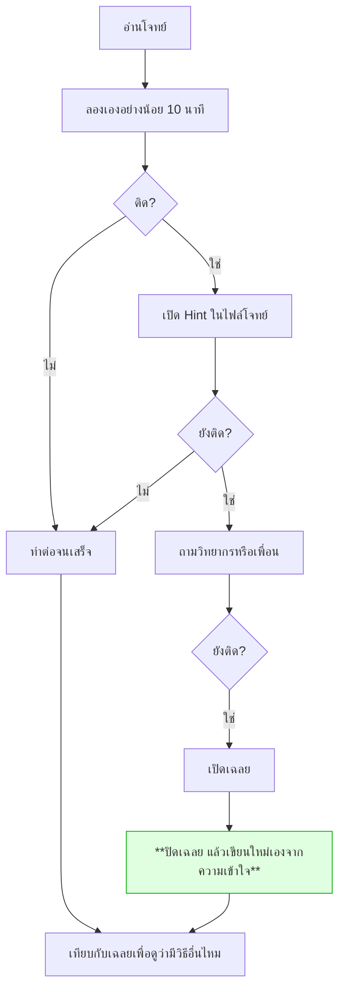

# เฉลย

> ## อ่านก่อนลอง = เสียโอกาสเรียนรู้
>
> เฉลยถูกจัดเก็บไว้ใน repo เดียวกันโดยตั้งใจ **การเปิดเผยอย่างตรงไปตรงมาย่อมดีกว่าการปิดบังจนมีผู้ค้นพบเอง**
>
> แต่โปรดเข้าใจว่า สิ่งที่ทำให้ผู้เรียนเขียน agent ได้อย่างเชี่ยวชาญ มิใช่การได้เห็นโค้ดที่ทำงานถูกต้อง
> หากแต่เป็น **ช่วงเวลาที่ติดขัดแล้วต้องหาทางออกด้วยตนเอง** ซึ่งเป็นสิ่งเดียวที่การเปิดเฉลยจะพรากไปจากผู้เรียนได้

---

## ใช้เฉลยอย่างไรให้ยังได้เรียนรู้

**ขั้นตอนที่สำคัญที่สุดคือขั้นตอนสีเขียว** — การคัดลอกโค้ดไม่ก่อให้เกิดความเข้าใจ แต่การอ่านแล้วปิดเฉลยเพื่อเขียนขึ้นใหม่ด้วยตนเองต่างหากที่ทำให้เกิดความเข้าใจอย่างแท้จริง

---

## สารบัญ

| กิจกรรม | เฉลยอยู่ที่ |
|---|---|
| Module 1 · LLM ทำงานอย่างไร | ใช้ `apps/agent-api/agent/tokenizer.py` ที่มีอยู่แล้ว ไม่มีไฟล์เฉลยแยก |
| Module 2a · Vector ใน PostgreSQL | ไม่มีไฟล์เฉลยแยก (อ้างอิงสคริปต์ `scripts/embed_tickets.py`) |
| Module 2b · Vector ใน Neo4j | ไม่มีไฟล์เฉลยแยก (อ้างอิงสคริปต์ `scripts/embed_devices.py`) |
| Module 2c · Embeddings กับ OpenSearch | [`day1/ticket_opensearch_lab.py`](day1/ticket_opensearch_lab.py) |
| Workshop 1 · ตัวแยกข้อมูล Ticket | [`day1/workshop1_extractor.py`](day1/workshop1_extractor.py) |
| Module 4-6 · ReAct Pattern / ReAct Loop / เครื่องมือ 3 ฐานข้อมูล | [`day2/workshop2_agent.py`](day2/workshop2_agent.py) |
| Module 7 · Intent Gate | `apps/agent-api/agent/intent.py` |
| Module 8 · Memory | `apps/agent-api/agent/memory.py` |
| Workshop 2 · ReAct Agent สำหรับ NOC | [`day2/workshop2_noc_agent.py`](day2/workshop2_noc_agent.py) |
| Module 9 · MCP คืออะไร | `apps/mcp-server/` (สาธิตโดยวิทยากร ไม่มีไฟล์เฉลยแยก) |
| Module 10 · ความปลอดภัยพื้นฐาน | `apps/mcp-server/security/guardrails.py` |
| Workshop 3 · MPLS NOC MCP Server | [`day3/workshop3_mcp_server.py`](day3/workshop3_mcp_server.py) |

อ่านคำอธิบายแต่ละวันที่ [day1/README.md](day1/README.md) · [day2/README.md](day2/README.md) · [day3/README.md](day3/README.md)

---

## หมายเหตุสำคัญ

**`apps/mcp-server/` คือระบบ MCP Server ที่ทำงานสมบูรณ์อยู่แล้ว ใช้เป็นเฉลยอ้างอิงของ Workshop 3**

โค้ดใน `apps/mcp-server/`, `apps/agent-api/` และ `apps/chainlit-ui/` เป็นระบบที่ทำงานได้จริง และเป็นตัวเดียวกับที่ container เดโมใช้ — **Workshop 3 ไม่ได้ให้แก้ไขโฟลเดอร์นี้โดยตรง** งานจริงคือสร้างไฟล์ใหม่ของตนเองที่ root ของโปรเจกต์ ชื่อ `workshop3_mcp_server.py` (แนวทางเดียวกับ `workshop1_extractor.py` และ `workshop2_agent.py`/`workshop2_noc_agent.py` ที่เป็นไฟล์เดียวจบ ไม่ต้องแยกเป็นแพ็กเกจ) แล้วเทียบผลกับ `apps/mcp-server/` ตอนจบ

---

## เฉลยไม่ใช่คำตอบเดียวที่ถูก

หลายโจทย์มีวิธีแก้ที่ดีกว่าเฉลย หากผู้เรียนคิดวิธีที่ต่างออกไปได้ **นั่นย่อมดีกว่าการทำตามเฉลย**

สิ่งที่ต้องเทียบคือ *เกณฑ์ผ่าน* ในไฟล์โจทย์ ไม่ใช่ความเหมือนกับโค้ดเฉลย
